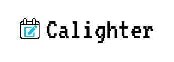

<p align="center"></img></p>

---

<h3 align="center">Highlight text anywhere → Instantly add it to Google Calendar with local NLP!</h3> 

<p align="center"> 
<a href="https://reactjs.org/"></a> 
<a href="https://www.typescriptlang.org/"></a> 
<a href="https://developer.mozilla.org/en-US/docs/Web/JavaScript"></a> 
<a href="https://vitejs.dev/"></a> 
<a href="https://tailwindcss.com/"></a> 
<a href="https://mui.com/"></a> 
<a href="https://www.framer.com/motion/"></a> 
<a href="https://onnxruntime.ai/"></a> 
<a href="https://huggingface.co/"></a> 
<a href="https://developers.google.com/calendar"></a> 
<br></br>
<a href="https://developer.chrome.com/docs/extensions/"></a> 
<a href="./LICENSE"></a> 
<a href="https://github.com/KRMed/calighter/commits/main"></a> </p> 
  
--- 

## 🚀 Overview 
**Calighter** is a Chrome extension that lets you highlight any text on the web and instantly add it to your Google Calendar as an event. It uses a local AI model for smart date/time extraction and event generation—no data leaves your machine. 
- **Local AI:** All language processing runs locally for privacy.
- **Fast & Simple:** Highlight → Click → Calendar event.
- **Customizable:** Tweak your event details even after highlighting!

---

## 🔑 Features 
- Highlight → One-click event creation
- Local AI (NER) to extract Event / Time / Location
- Natural language date parsing (AI + chrono-node fallback)
- Google Calendar integration with retry + token refresh
- Editable event fields (title, start/end time, location, description)
- Smart progressive time input mask (MM/dd/yyyy, hh:mm aa)
- Side panel + popup support (Manifest V3)
- Fully local inference (no external server for text processing)
- Graceful handling of network/API errors

---

## 🛡️ Permissions & Privacy

Calighter only requests the permissions it needs to parse highlights locally and create calendar events.

> **Tip:** If you don’t need a persistent content script, you can rely on `activeTab` + `scripting.executeScript` and drop blanket host permissions.

| API / Permission / Scope | Why It’s Needed | Notes |
|--------------------------|-----------------|-------|
| `identity`               | Google OAuth sign-in | Used only to request Calendar scopes |
| `storage`                | Cache model + user prefs | Stores model artifacts and lightweight state locally |
| `activeTab` / `scripting`| Inject (or message) content script on demand | Reads current selection when popup is active |
| `sidePanel` (API)        | Optional UI surface | Requires Chrome 114+; set via `"side_panel"` in manifest |
| (Optional) Host Permissions (`https://*/*`, `http://*/*`) | For persistent content script injection | Prefer `activeTab` if possible |
| Scopes: `calendar.readonly`, `calendar.events` | Read calendars + create events | Only data you submit is sent to Google |

**Privacy:**
- Parsing runs **locally** in the browser (ONNX Runtime).
- No third-party servers; no analytics or telemetry.
- Only the event payload you confirm is sent to Google Calendar.

---

## 🤖 AI Model

- **Current Model:** [Calighter Model](https://huggingface.co/donteattofu/calighter-model) (fine‑tuned for EVENT / TIME / LOCATION)
- **Base Model:** [microsoft/MiniLM-L12-H384-uncased](https://huggingface.co/microsoft/MiniLM-L12-H384-uncased)
- **Inference:** Runs client-side (WebAssembly backend). Model weights fetched once and cached.
- **Fallback Parsing:** [chrono-node](https://github.com/wanasit/chrono) for ambiguous or complex date phrases.

---

## 🏁 Quick Start (Unpacked User Install)

1. Clone repository  
   ```bash
   git clone https://github.com/KRMed/Calighter.git
   cd Calighter
   ```
2. Install dependencies  
   ```bash
   npm install
   ```
3. Build (generates `dist` with manifest & assets)  
   ```bash
   npm run build
   ```
4. Open `chrome://extensions` → Enable **Developer Mode** → “Load unpacked” → select the `dist` folder.
5. Click the extension icon → **Sign in with Google** → Highlight text on any page.

> 🚧 Chrome Web Store publication in progress 🚧

---

## 🧑‍💻 Developer Setup (OAuth + Watch Mode)

**Prereqs:** Node 18+, Chrome 114+, Google account.

1. Clone & install  
   ```bash
   git clone https://github.com/KRMed/Calighter.git
   cd Calighter
   npm install
   ```
2. (Optional if you want your own credentials) Create Google OAuth credentials  
   - Google Cloud Console → create/select a project  
   - Enable “Google Calendar API” (APIs & Services → Library)  
   - Create OAuth 2.0 Client ID (Web application)  
   - Add Authorized redirect URI:  
     ```
     https://<EXTENSION_ID>.chromiumapp.org/
     ```
   - How to get `<EXTENSION_ID>`: temporarily load the extension once (step 4) → copy the ID from `chrome://extensions`.
3. (If customizing OAuth) Update `manifest.json` `oauth2.client_id` with your Client ID.  
   > If you choose an env-based approach, expose `VITE_GOOGLE_CLIENT_ID` and reference it in your OAuth helper code.
4. Run in watch mode  
   ```bash
   npm run dev
   ```
   Then load (or reload) the `dist/` folder via `chrome://extensions`.
5. Sign in & test  
   - Open the popup → Sign in with Google  
   - Highlight text → reopen popup → confirm fields → “Add to Calendar”
6. Iterate  
   - Keep `npm run dev` running  
   - After rebuilds: click “Reload” on the Calighter card in `chrome://extensions`
7. Debugging  
   - Service worker logs: `chrome://extensions` → “Service worker” link under Calighter  
   - Content script logs: page DevTools Console  
   - Popup logs: Right-click popup → Inspect
8. Scopes requested  
   ```
   https://www.googleapis.com/auth/calendar.readonly
   https://www.googleapis.com/auth/calendar.events
   ```
9. Notes  
   - Add a `"key"` to `manifest.json` to stabilize the extension ID across rebuilds (optional).  
   - Parsing is local (ONNX Runtime). Only confirmed event data is sent to Google.

### (Optional) Alternate Minimal Permissions Strategy

If you remove blanket host permissions:
- Drop `host_permissions`
- Use `activeTab` + `chrome.scripting.executeScript` (or message existing content script only after user action)
- Reduces permission prompt footprint
